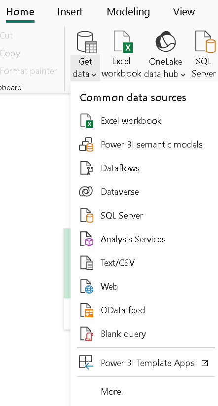

# Blinkit Data Analysis using Power BI

## Project Overview

####```Project Title: Blinkit Data Analysis```   
####```Level: Intermediate```

This project showcases Blinkit Data Analysis in Power BI, including data import, cleaning, measure creation, and interactive dashboards. It also highlights Additional features like RSL and scheduled refresh, demonstrating skills in data transformation and business problem-solving.


## Objectives

1. **Importing Data into Power BI**: Import Blinkit data for analysis in Power BI.
2. **Power Query Data Transformation**: Clean and transform data using Power Query to ensure accuracy and consistency.
3. **Addressing Business Challenges and Problem Statements**: Analyze and interpret the business statement to define key challenges and objectives.
4. **Create Measures**: .
5. **Design and deploy interactive Cards and Charts**: .
6. **Additional Features in Power BI**: Explore and understand advanced features in Power BI.

## Importing Data Into Power BI

### 1. Excel Data Import: We will import data into Power BI via Excel file upload for this project.

### 2. Alternative Data Import Methods: Power BI supports various data import methods, including databases, files, cloud storage, web pages, etc. 


## Power Query Data Transformation
### 1. Uses:
Power Query is primarily used to transform and refine data from various sources, enabling users to clean, merge, and shape data into a usable format for analysis and visualization in Power BI.

### 2. Data Cleaning

``` In the "Fat Content" column, there are inconsistencies in how values like "Low Fat", "low fat", "Reg" and "Regular" are recorded. We cleaned the data by standardizing these values into consistent categories. This ensured uniformity, making the data more reliable and enhancing the dashboard's overall effectiveness, enabling better analysis and decision-making.```

    

``` After cleaning the data, we standardized the "Fat Content" column to include only two consistent values: "Regular" and "Low Fat" This simplification eliminated inconsistencies and ensured that the data was uniform, making it more reliable and impactful for analysis and visualization in the dashboard.```   


## Addressing Business Challenges and Problem Statements

### 1. KPI's Requirements


### 2. Charts Requirements    


## Create Measures    
**Requires four measures: Total Sales, Average Sales, Number of Items, and Average Ratings.**

```sql
-- Create a Measure for "Total Sales"
Total Sales = SUM('BlinkIT Grocery Data'[Sales])    

-- Create a Measure for "Average Sales"
Average Sales = AVERAGE('BlinkIT Grocery Data'[Sales])       

-- Create a Measure for "Total Items"
Number of Items = COUNTROWS('BlinkIT Grocery Data')    

-- Create a Measure for "Average Ratings"
Average Ratings = COUNTROWS('BlinkIT Grocery Data')             
```
## Design and deploy interactive Cards and Charts

### 1. Cards

### 2. Charts
**Task 01: Total sales by fat content**    
Analyzed sales by fat content, focusing on "Regular" and "Low Fat" categories to identify customer preferences.

**Task 02: Total sales by item type**
Calculated total sales for each item type to highlight top-performing categories.

**Task 03: Fat content by outlet for total sales**
Examined fat content distribution across outlets to identify outlet-specific preferences.


**Task 04: Total sales by outlet establishment**
Analyzed sales by outlet establishment to assess individual outlet performance.


**Task 05: Sales by outlet size**
Studied sales across different outlet sizes to find correlations between size and sales volume.


**Task 06: Sales by outlet location**
Assessed how outlet location affects sales, revealing regional preferences.


**Task 07: All metrics by outlet type**
Aggregated all metrics by outlet type to understand performance trends across different outlet models.


## Additional Features in Power BI

### **Task 01: RSL(Row-level Security)**  
Row-level security (RLS) in Power BI limits data access for users based on defined filters, ensuring they only see the data they are authorized to view.  

### ```Modeling > Manage Roles > New > Select Table > Add Filter > Save```

## **Task 14: Scheduled Refresh**  
Scheduled refresh in Power BI automatically updates your data at specified intervals, ensuring reports and dashboards display the most up-to-date information without manual intervention.    
### ```Power BI Desktop > Publish to Your Workspace > Log in to Power BI Service > Workspace > Datasets > Under Scheduled Refresh > Set frequency and time > Apply```

## Conclusion

This project demonstrated how data analysis can provide valuable insights into Blinkit's performance, helping optimize sales, inventory, and customer service. It highlighted the platform's potential for growth and improved operational efficiency.
